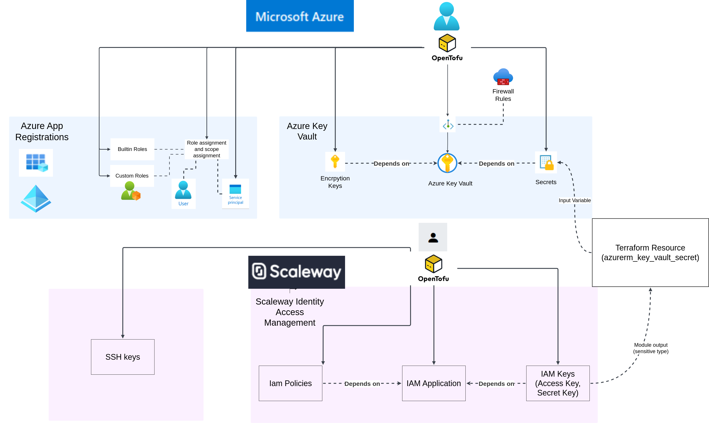

# Multicloud IAM management using Azure Key Vault, RSA keys and secrets



## Introduction

This article primarily illustrates the use of azure key vault and how it
can be used as a secure housing for secrets and encryption keys regardless of
whether those secrets originate from another cloud or environment.

Secondarily, this article illustrates how terraform/opentofu can be
a powerful tool to manage resources such as secrets across multiple clouds.

A scaleway IAM application is created and the IAM keys that pertain
to the IAM application are stored in the Azure Key Vault.

Azure Key Vault is the central secrets manager
of choice and can be used to encrypt secrets through encryption keys
and to store secrets securely. In this case, Azure Key Vault is used to store
the scaleway IAM access key and secret key.

## Steps to create the scaleway IAM application and API Keys

A scaleway IAM application with permissions to perform operations
on s3 compatible object storage is required. An additional requirement
is that the access key and secret key for the application
are stored safely. For the latter, the Azure Key Vault was chosen.

### Create the scaleway application

The scaleway application is an identity which can be used to grant
software applications and automation tools to scaleway cloud resources.

### Create the scaleway IAM policies

Policies are RBAC (Role Based Access Control) rules in scaleway. The
equivalent in Azure is roles and role assignments which was described
[in another article on service principals](https://stephenmoloney.com/blog/creating-an-azure-service-principal-opentofu/).

The following two elements are key to defining the rules:

- The scaleway project to which the rules apply (equivalent to the scope in Azure)
- The permission sets to allow
  - `ObjectStorageBucketsDelete`
  - `ObjectStorageBucketsRead`
  - `ObjectStorageBucketsWrite`
  - `ObjectStorageObjectsDelete`
  - `ObjectStorageObjectsRead`
  - `ObjectStorage`
  - `ObjectsWrite`

### IAC code to create the scaleway application and assignment of policies

In order to create the scaleway IAM application and associated policies, a module
was written and adopted. The module can be found [on github at eirenauts/tf-modules](https://github.com/eirenauts/tf-modules/tree/main/modules).

The `terraform.auto.tfvars.json` needs to be set for variable configuration.
Do not allow this file to be tracked by version control.

```json
{
  "scw_multicloud_iam": {
    "description": "IAM for priveleges to act on s3 objects",
    "name": "scw-multicloud-iam",
    "organization_id": "_redacted_",
    "policies": {
      "scw_multicloud_iam_1": {
        "description": "Object storage for demonstartion purposes",
        "name": "scw-multicloud-iam-1",
        "permission_sets": [
          "ObjectStorageBucketsRead",
          "ObjectStorageBucketsWrite",
          "ObjectStorageBucketsDelete",
          "ObjectStorageObjectsWrite",
          "ObjectStorageObjectsDelete",
          "ObjectStorageObjectsRead"
        ],
        "project_names": ["<redacted_project_name>"]
      }
    },
    "project_id": "_redacted_",
    "tags": ["project=<redacted_project_name>"]
  }
}
```

```hcl-terraform
module "scw_iam" {
  source = "git::https://github.com/eirenauts/tf-modules.git//modules/scw-iam?ref=0.0.6"

  for_each = var.scw_iam
  scw_iam = each.value
  scw_iam_policies = each.value.policies
}
```

### IAC code to create the azure key vault

The `terraform.auto.tfvars.json` needs to be set for variable configuration.
Do not allow this file to be tracked by version control.

```json
{
  "az_key_vaults": {
    "az_multicloud_key_vault": {
      "access_policies": [
        {
          "certificate_permissions": [
            "Backup",
            "Create",
            "Delete",
            "DeleteIssuers",
            "Get",
            "GetIssuers",
            "Import",
            "List",
            "ListIssuers",
            "ManageContacts",
            "ManageIssuers",
            "Purge",
            "Recover",
            "Restore",
            "SetIssuers",
            "Update"
          ],
          "key_permissions": [
            "Backup",
            "Create",
            "Decrypt",
            "Delete",
            "Encrypt",
            "Get",
            "GetRotationPolicy",
            "Import",
            "List",
            "Purge",
            "Recover",
            "Release",
            "Restore",
            "Rotate",
            "SetRotationPolicy",
            "Sign",
            "UnwrapKey",
            "Update",
            "Verify",
            "WrapKey"
          ],
          "principal_name": "<your_admin_level_user_principal>",
          "secret_permissions": [
            "Backup",
            "Delete",
            "Get",
            "List",
            "Purge",
            "Recover",
            "Restore",
            "Set"
          ],
          "storage_permissions": [
            "Backup",
            "Delete",
            "DeleteSAS",
            "Get",
            "GetSAS",
            "List",
            "ListSAS",
            "Purge",
            "Recover",
            "RegenerateKey",
            "Restore",
            "Set",
            "SetSAS",
            "Update"
          ],
          "type": "user-principal"
        },
        {
          "certificate_permissions": [],
          "key_permissions": ["Decrypt", "Encrypt"],
          "principal_name": "az-multicloud-app",
          "secret_permissions": ["Get", "List"],
          "storage_permissions": [],
          "type": "service-principal"
        }
      ],
      "enable_purge_protection": "true",
      "location": "North Europe",
      "name": "az-multicloud-key-vault",
      "network_rules": [
        {
          "bypass": "AzureServices",
          "default_action": "Deny",
          "ip_rules": ["<some_ip_block>/27", "<some_ip_address>/32"],
          "virtual_network_subnet_ids": []
        }
      ],
      "resource_group": "tf-modules-az-rg-1",
      "rsa_keys": [
        {
          "key_opts": ["decrypt", "encrypt"],
          "key_size": 4096,
          "name": "az-multicloud-rsa-key",
          "type": "RSA"
        }
      ],
      "sku": "standard",
      "tags": {
        "purpose": "key-vault to be consumed by applications and other terraform projects"
      }
    }
  }
}
```

The [external az-key-vault terraform/opentofu module](https://github.com/eirenauts/tf-modules/tree/main/modules)
was adopted to create the azure key vault.

```hcl-terraform
module "az_key_vaults" {
  source = "git::https://github.com/eirenauts/tf-modules.git//modules/az-key-vault?ref=0.0.6"
  for_each = var.az_key_vaults

  az_key_vault = each.value
  az_tenant_id = var.azure.tenant_id
}
```

### IAC code to create the azure key vault secrets for storing the Scaleway IAM application API keys

The `terraform.auto.tfvars.json` needs to be set for variable configuration.
Do not allow this file to be tracked by version control.

```json
{
  "az_scw_iam_secrets": {
    "az_multicloud_app_access_key": {
      "name": "az-multicloud-app-access-key",
      "content_type": "text/plain",
      "expires": false,
      "expiry_day": null,
      "expiry_month": null,
      "expiry_year": null,
      "iam_key": "az_multicloud_app",
      "resource_group": "tf-modules-az-rg-1",
      "tags": {
        "purpose": "Access key for the scaleway example app"
      },
      "vault": "static-services-kv"
    },
    "az_multicloud_app_secret_key": {
      "name": "az-multicloud-app-secret-key",
      "content_type": "text/plain",
      "expires": false,
      "expiry_day": null,
      "expiry_month": null,
      "expiry_year": null,
      "iam_key": "az_multicloud_app",
      "resource_group": "tf-modules-az-rg-1",
      "tags": {
        "purpose": "Secret key for the scaleway example app"
      },
      "vault": "az-multicloud-key-vault"
    }
  }
}
```

The [external az-key-vault terraform/opentofu module](https://github.com/eirenauts/tf-modules/tree/main/modules)
was adopted to create the azure key vault secrets.

The key for each secret needs to contain either the substring `_access_key` or substring `_secret_key`.

```hcl-terraform
module "az_scw_iam_secrets" {
  depends_on = [module.az_key_vaults, module.scw_iam]
  source     = "git::https://github.com/eirenauts/tf-modules.git//modules/az-key-vault-secret?ref=0.0.6"

  for_each = var.az_scw_iam_secrets
  az_vault_secret = each.value
  az_vault_secret_value = (
    strcontains(each.key, "access_key") ?
    module.scw_iam[each.value.iam_key].iam_application_access_key :
    module.scw_iam[each.value.iam_key].iam_application_secret_key
  )
}
```

This module depends on the azure key vault and scaleway iam already having been created
and defined previously in the terraform/opentofu code as a resource or a data source.

The secret is acquired as an terraform/opentofu output from the `scw_iam` module.

A full implementation of this example can be found in the examples folder
of the [eirenauts/tfmodules](https://github.com/eirenauts/tf-modules/tree/main/examples).

## Discussion

The IAC code above demonstrates how to

- Create a scaleway application
- Create scaleway policies and apply them to the scaleway application
- Create the azure key vault
- Create the scaleway IAM application API Keys
- Create azure key vault secrets to store the scaleway IAM API keys

This is a useful approach when azure key vault is the single central controller
and store for secrets regardless of the cloud environment from which the secret
originates. Using secret managers from multiple cloud and private clouds would
add more overhead in terms of required work from devops engineers.

## Conclusion

Terraform/Opentofu is an essential IAC tool for creating resources in the cloud.
It makes multicloud infrastructure management a breeze as it allows for
taking outputs for one resource as the inputs to another.
