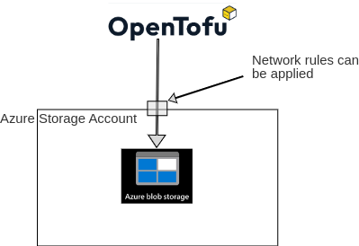

# Creating an Azure Backend for terraform/opentofu



Terraform/Opentofu are leading tools for building and maintaining infrastructure
as code. However, there is a chicken and egg problem, in order to
have a terraform/opentofu backend, some infrastructure is needed. The backend can be an object
storage backend in AWS, GCP, Azure and many other providers.

This document describes the process for using Azure.

The resources required in Azure are

    - A storage account
    - A container within the storage account
    - A blob (object store) within the container

Blobs on azure storage accounts are quite feature complete for the purposes of a terraform/opentofu
backend perspective. The locking is builtin. The networking for the container is
configurable which has security benefits. In AWS, to get state locking, a dynamodb
table is needed which means creating an s3 bucket and a dynamodb table. That means more
steps - which is why I prefer to use Azure Blob Storage as my preferred terraform/opentofu backend.

## Create the standalone azure resources

A standalone resource group and storage container is created first in order
so that the subsequent resources can be deployed using terraform/opentofu and more highly
automated technologies.

### Login to azure with the correct subscription

In this instance, login with a user account. For subsequent resources where there
is greater automation, a service principal or managed identity can be used.

```bash
az login
```

### Select the correct subscription

```bash
az account list --output table
```

For these operations, we will use the `your-subscription` subscription.

```bash
az account set --subscription "your-subscription"
```

### Get a list of possible locations

```bash
az account list-locations -o table
```

### Create the resource group in the desired location

```bash
az group create \
  --verbose \
  --location northeurope \
  --resource-group your-subscription-standalone-rg \
  --tags \
    'managed-by=az-cli' \
    'environment=standalone' \
    'purpose=tf-backend' \
    'source=https://github.com/eirenauts/tf-modules/tree/main/docs/creating_az_tf_backend.md'
```

### Create the azure storage account

The purpose of the `your-subscription-standalone-rg` resource group is to
have a azure storage as a once off backend for subsequent terraform/opentofu operations
to create more terraform/opentofu backends.

```bash
az storage account create \
    --verbose \
    --location northeurope \
    --resource-group your-subscription-standalone-rg \
    --name your-tf-storage-account \
    --sku Standard_LRS \
    --kind BlobStorage \
    --access-tier Cool \
    --https-only true \
    --encryption-services blob \
    --min-tls-version TLS1_2 \
    --allow-blob-public-access false \
    --require-infrastructure-encryption false \
    --default-action Deny \
    --tags \
      'managed-by=az-cli' \
      'environment=standalone' \
      'purpose=tf-backend' \
      'source=https://github.com/eirenauts/tf-modules/tree/main/docs/creating_az_tf_backend.md'
```

### Restrict traffic to the azure storage account

#### Ip exceptions table

`<your_ip_block>/27` corresponds to a block of public IP addresses which you will allow access to the storage container.

The rationale behind this is to restrict access to the storage backend substantially and
therefore greatly increase the security of the backend.

| IP                   |
| -------------------- |
| `<your_ip_block>/27` |
| `<your_ip>/32`       |

```bash
allowed_ips=( <your_ip_block>/27 <your_ip> )
for ip in "${allowed_ips[@]}"; do
  az storage account network-rule add \
    --verbose \
    --resource-group your-subscription-standalone-rg \
    --account-name your-tf-storage-account \
    --action Allow \
    --ip-address "${ip}"
done
az storage account show \
  --verbose \
  --resource-group your-subscription-standalone-rg \
  --name your-tf-storage-account \
  --query '{"Storage Account Name":name, "Resource Group":resourceGroup, RuleSet:networkRuleSet}'
```

### Create storage containers for the terraform/opentofu backends

```bash
az_storage_acccount_containers=("examples-az-resource-groups")
for az_storage_acccount_container in "${!az_storage_acccount_containers[@]}"; do
  az storage container create \
    --verbose \
    --account-name your-tf-storage-account \
    --resource-group your-subscription-standalone-rg \
    --name "${az_storage_acccount_container}" \
    --public-access "off" \
    --fail-on-exist
done
```

## Initialize the terraform/opentofu backend

### Create the `backend.tf` file in the main module

```hcl-terraform
terraform {
  backend "azurerm" {
  }
}
```

### Initialize the backend

```bash
tofu init \
    -backend-config "resource_group_name=your-subscription-standalone-rg" \
    -backend-config "storage_account_name=your-tf-storage-account" \
    -backend-config "container_name=your-tf-container-name" \
    -backend-config "key=default.tfstate" \
    -backend-config "sas_token=your-sas-token"
```

| Resource             | Notes                                                                                     |
| -------------------- | ----------------------------------------------------------------------------------------- |
| resource_group_name  | The azure resource group housing the azure storage account                                |
| storage_account_name | The azure storage account housing the azure container                                     |
| container_name       | The azure container name - housing the blob storage                                       |
| key                  | The key to access the blob storage. Defaults to default.tfstate                           |
| sas_token            | This key is used by terraform/opentofu to obtain permissions to read/write to the backend |

### Creating a sas token

One way to create a sas token is described already at `.ci/functions_az.sh`.

The code is copied below which you can use to generate a new sas token

```bash
function generate_sas_key() {
    local subscription="${1}"
    local storage_account_name="${2}"

    if [[ -z "${storage_account_name}" ]]; then
        echo "variable storage_account_name must be set" >>/dev/stderr
        exit 1
    fi

    if [[ -z "${subscription}" ]]; then
        echo "variable subscription must be set" >>/dev/stderr
        exit 1
    fi

    az storage account generate-sas \
        --expiry "$(date -d "+1 days" +%Y-%m-%d)"'T00:00:00Z' \
        --permissions "acdlpruw" \
        --resource-types "co" \
        --services "b" \
        --account-name "${storage_account_name}" \
        --https-only \
        --subscription "${subscription}" \
        -o tsv
}
```

## Wrap up

This concludes the steps to create a terraform backend using azure. And this is the
method I use myself to create storage accounts for terraform backends where there is
a lack of existing infrastructure available as alternatives.

I would recommend you only use a backend that is highly available and
has terraform state locking compatibility to avoid problems later.
