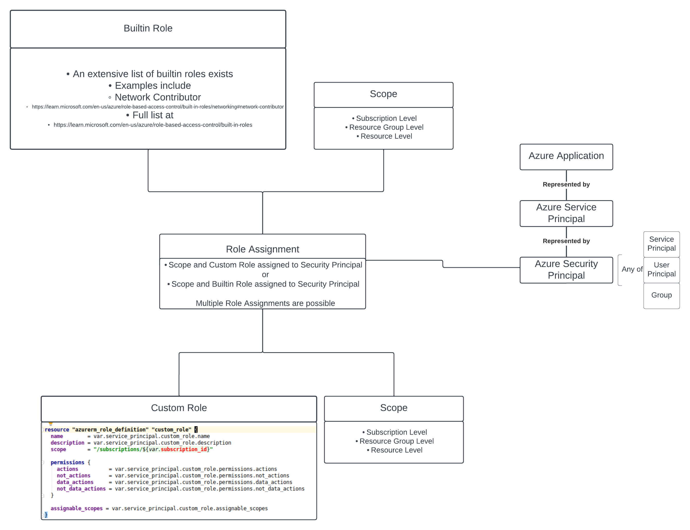

# Creating an Azure Service Principal with Opentofu


This article serves as documentation also and has been pushed to github
at [this location](https://github.com/eirenauts/tf-modules/tree/main/docs).

## Introduction

I wrote a post a few years ago about how to create a service principal using
the [Azure CLI](https://stephenmoloney.com/blog/creating-a-service-principal/).

Since then, I moved this logic into opentofu. However, I still believe that
creating applications and service principals with the Azure CLI is perfectly
valid approach because the application and service principal identity are what go
on to perform the automation. Hence, it is quite possible it will be one of the few
things done via the CLI at the outset. Nevertheless, I decided for myself that
moving as much logic to opentofu as possible made sense for me.

At the start of a opentofu project, there are a few key components that will be
needed before the `tofu plan` and `tofu apply` operations can be executed
via automation. As a minimum, this will include:

    - A resource group in the case of Azure - to host the remote backend and the service principal.
    - A remote opentofu backend with locking - azure blob storage in the case of Azure.
    - A service principal in the case of azure, service account in the case of GCP or AWS.
    - A git repository server for the opentofu codebase - Github, Gitlab, etc.
    - A CI/CD system like Azure Devops, GitlabCI, Circle CI, Jenkins, etc.
    - Self hosted private runners for the CI/CD system.
    - An account with the cloud provider of choice and if multicloud, multiple accounts.

The purpose of this post is to manage the following resources using infrastructure
as code techniques by way of Opentofu.

- An azure application
- A service principal
- A custom role
- A role assignment (between a scope, custom role and the service principal)

An azure application is a type of Azure Active Directory Identity. It is a means of
allowing applications to authenticate with Azure services using the APIs.

A service principal is an instance or representative of the azure application. It determines
which resources the application object will be allowed to access.

A security principal can represent users, groups or service principals. The granting of access
to resources is achieved using a the binding of a role and scope to a security principal.
In other words, a role assignment between the scope and the security principal and
the role and the security principal. The result of the role assignment is that it will acquire
permissions to execute a collection of actions against a set of resources in a particular scope.

For example, permission to perform action `Microsoft.Storage/*/read` in the scope
`subscriptions/<redacted-subscription-id>/resourceGroups/az-<redacted-resource-group>`.


Source: [Microsoft Docs](https://learn.microsoft.com/en-us/azure/role-based-access-control/media/shared/rbac-security-principal.png)

The way a security principal gets a permission to execute an action is when it undergoes
**_role assignment_**. A [built-in role](https://learn.microsoft.com/en-us/azure/role-based-access-control/built-in-roles) or
a [custom role](https://learn.microsoft.com/en-us/azure/role-based-access-control/custom-roles) can be assigned to the
security principal, giving it access to a group of resources. The scope is also assigned
so that the level of access can be distilled to a subscription, resource group or resource level.

A simple diagram is below to illustrate the relationships.



## Steps to create the service principal with opentofu

The steps will be illustrated using opentofu hcl code. And eventually, an example
is planned be available to view at [this codebase](https://github.com/eirenauts/tf-modules/tree/main/examples/).

The hcl module used for the coding is already available at
[this link](https://github.com/eirenauts/tf-modules/tree/main/modules/az-service-principal).

The key component required is the [Azure Active Directory terraform provider](https://registry.terraform.io/providers/hashicorp/azuread/latest/docs).

### Login to azure with the correct subscription and create the opentofu backend

For this, see a previous blog. This is a key part of bootstrapping a terraform or
opentofu project and a full blog about it is [available here](https://stephenmoloney.com/blog/creating-an-opentofu-backend/).

### Skaffold an opentofu project

There are several ways to layout an opentofu project, there are some
examples [here](https://github.com/eirenauts/tf-modules/tree/main/examples) on
how I do it. Skaffolding the opentofu project is beyond the purpose of this article.

### Create the variables for deploying service principals

The following block of json code is created in a `terraform.auto.tfvars.json` file
and depicts how to create a service principal from both a custom role and a builtin
role. The designation `role_type` determines the role assignment as a custom or builtin role.

```json
{
  "az_service_principals": {
    "app_1_dns": {
      "az_ad_application_name": "app-1-dns",
      "builtin_role": {
        "assigned_scopes": ["/subscriptions/<redacted-subscription-id>"],
        "name": "DNS Zone Contributor"
      },
      "custom_role": {
        "assignable_scopes": ["/subscriptions/<redacted-subscription-id>"],
        "assigned_scopes": ["/subscriptions/<redacted-subscription-id>"],
        "description": "Dummy role",
        "name": "app-1-dns-dummy-role",
        "permissions": {
          "actions": ["Microsoft.Insights/diagnosticSettings/*"],
          "data_actions": [],
          "not_actions": [],
          "not_data_actions": []
        },
        "scope": "/subscriptions/<redacted-subscription-id>"
      },
      "description": "Service principal for dns operations - DNS Zone Contributor",
      "hours_to_expiry": "5760",
      "role_type": "builtin",
      "skip_service_principal_aad_check": false
    },
    "app_2_custom": {
      "az_ad_application_name": "app-2-custom",
      "builtin_role": {
        "assigned_scopes": [
          "/subscriptions/<redacted-subscription-id>/resourceGroups/<redacted-resource-group>"
        ],
        "name": ""
      },
      "custom_role": {
        "assignable_scopes": ["/subscriptions/<redacted-subscription-id>"],
        "assigned_scopes": [
          "/subscriptions/<redacted-subscription-id>/resourceGroups/<redacted-resource-group>"
        ],
        "description": "Can perform most important actions",
        "name": "app-2-custom",
        "permissions": {
          "actions": [
            "Microsoft.Storage/*/read",
            "Microsoft.Storage/*/write",
            "Microsoft.Storage/*/delete",
            "Microsoft.Storage/storageAccounts/listKeys/action",
            "Microsoft.Storage/storageAccounts/ListAccountSas/action",
            "Microsoft.Storage/storageAccounts/read",
            "Microsoft.Network/*/read",
            "Microsoft.Network/*/write",
            "Microsoft.Network/*/delete",
            "Microsoft.Compute/*/read",
            "Microsoft.Compute/*/write",
            "Microsoft.Compute/*/delete",
            "Microsoft.Compute/virtualMachines/start/action",
            "Microsoft.Compute/virtualMachines/restart/action",
            "Microsoft.KeyVault/vaults/read",
            "Microsoft.Authorization/*/read",
            "Microsoft.ResourceHealth/availabilityStatuses/read",
            "Microsoft.Resources/subscriptions/resourceGroups/read",
            "Microsoft.Insights/alertRules/*",
            "Microsoft.Insights/diagnosticSettings/*"
          ],
          "data_actions": [
            "Microsoft.KeyVault/vaults/keys/read",
            "Microsoft.KeyVault/vaults/keys/encrypt/action",
            "Microsoft.KeyVault/vaults/keys/decrypt/action",
            "Microsoft.KeyVault/vaults/secrets/getSecret/action",
            "Microsoft.KeyVault/vaults/secrets/readMetadata/action"
          ],
          "not_actions": [],
          "not_data_actions": []
        },
        "scope": "/subscriptions/<redacted-subscription-id>"
      },
      "description": "Service principal app for most operations including storage, network, compute and some vault actions",
      "hours_to_expiry": "5760",
      "role_type": "custom",
      "skip_service_principal_aad_check": false
    }
  }
}
```

### Deploy the service principals

The service principals are deployed using a `for_each` loop which iterates over each declaration
in the json file.

```hcl-terraform
module "az_service_principals" {
  source = "git::https://github.com/eirenauts/tf-modules.git//modules/az-service-principal?ref=0.0.4"

  for_each = {
    for service_principal in var.az_service_principals :
    service_principal.az_ad_application_name => service_principal
  }

  service_principal = each.value
  subscription_id   = var.azure.subscription_id
}
```

**_NOTE: Always use tagged commits for your source attributes, to avoid unexpected surprises as much as possible_**

## Analysis of the `az-service-principal` module internals

**_NOTE: If you are not interested in the internals of the module, skip this part_**

The code itself explains the logic.

The module can be found at this [link](https://github.com/eirenauts/tf-modules/blob/main/modules/az-service-principal/service-principal.tf).

### Creating the application and associated service account

```hcl-terraform
resource "azuread_application" "application" {
  display_name = var.service_principal.az_ad_application_name
}

resource "azuread_service_principal" "service_principal" {
  client_id                    = azuread_application.application.client_id
  app_role_assignment_required = true
  description                  = var.service_principal.description
}
```

### Creating a custom role

```hcl-terraform

resource "azurerm_role_definition" "custom_role" {
  name        = var.service_principal.custom_role.name
  description = var.service_principal.custom_role.description
  scope       = "/subscriptions/${var.subscription_id}"

  permissions {
    actions          = var.service_principal.custom_role.permissions.actions
    not_actions      = var.service_principal.custom_role.permissions.not_actions
    data_actions     = var.service_principal.custom_role.permissions.data_actions
    not_data_actions = var.service_principal.custom_role.permissions.not_data_actions
  }

  assignable_scopes = var.service_principal.custom_role.assignable_scopes
}
```

### Creating a role assignment to a custom role

**_role_type=custom_**

The attribute `role_type` in the json definition, allows to differentiate
from the builtin role. The custom role type needs the `role_definition_id`
while the builtin role needs the `role_definition_name`.

The loop in this instance is over the as many scopes as have been assigned.

This was declared as a list in the json file

```json
        "assigned_scopes": [
          "/subscriptions/<redacted-subscription-id>/resourceGroups/<redacted-resource-group>"
        ]
```

Notice how the scope is included here.

```hcl-terraform
resource "azurerm_role_assignment" "role_assignment_custom" {
  for_each = (
    var.service_principal.role_type == "custom" ?
    toset(var.service_principal.custom_role.assigned_scopes) :
    toset([])
  )

  scope                            = each.value
  role_definition_id               = azurerm_role_definition.custom_role.role_definition_resource_id
  principal_id                     = azuread_service_principal.service_principal.id
  skip_service_principal_aad_check = var.service_principal.skip_service_principal_aad_check
}
```

### Creating a role assignment to a builtin role

**_role_type=builtin_**

The attribute `role_type` in the json definition, allows to differentiate
from the builtin role. The custom role type needs the `role_definition_id`
while the builtin role needs the `role_definition_name`.

The loop in this instance is over the as many scopes as have been assigned.

This was declared as a list in the json file

```json
        "assigned_scopes": [
          "/subscriptions/<redacted-subscription-id>/resourceGroups/<redacted-resource-group>"
        ]
```

```hcl-terraform
resource "azurerm_role_assignment" "role_assignment_builtin" {
  for_each = (
    var.service_principal.role_type == "builtin" ?
    toset(var.service_principal.builtin_role.assigned_scopes) :
    toset([])
  )

  scope                            = each.value
  role_definition_name             = var.service_principal.builtin_role.name
  principal_id                     = azuread_service_principal.service_principal.id
  skip_service_principal_aad_check = var.service_principal.skip_service_principal_aad_check
}
```

## Conclusion

The creation of service principals using [this az-service-principal module](https://github.com/eirenauts/tf-modules/tree/main/modules/az-service-principal)
can be as easy as writing out the json file declaratively and then just 4/5 lines of hcl code in
the `main.tf` file.

Applications and their associated service principals are critical elements of a Infrastructure as
Code strategy where the pipeline might execute actions such as terraform plan operations.

Other examples where applications and service principals are valuable is in-cluster actions such
as when the `cert-manager` operator takes actions on your behalf to ensure dns validations and ssl
certs are generated correctly with let's encrypt.

Finally, service principals have as much power to execute actions as the RBAC permissions granted
to them. It is also possible to [log in to an Azure CLI session using a service principal](https://learn.microsoft.com/en-us/cli/azure/authenticate-azure-cli-service-principal).

So keep the credentials safe!
